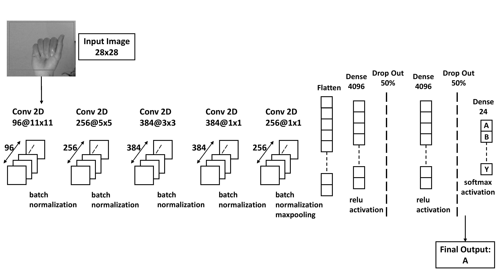
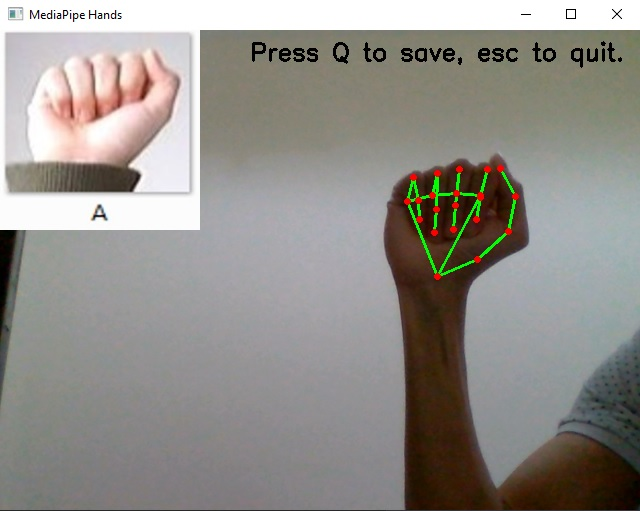
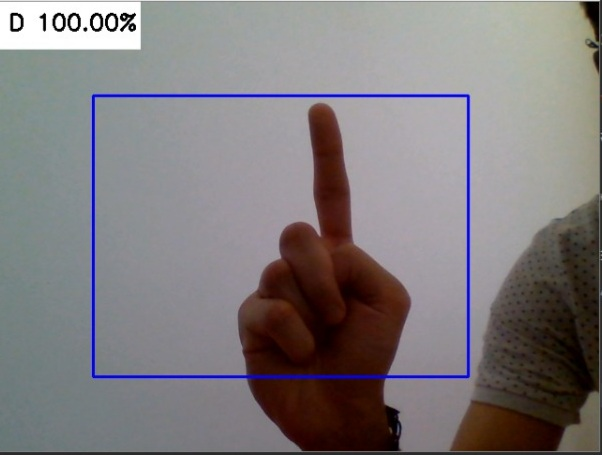
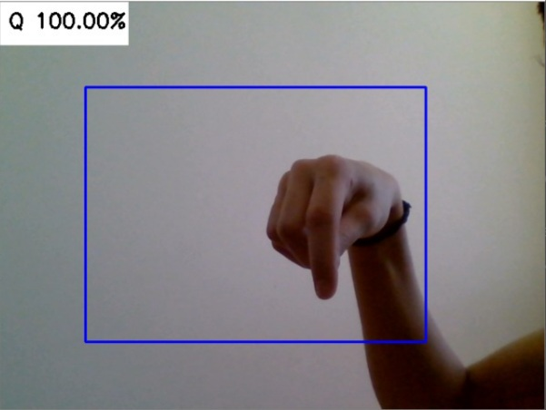
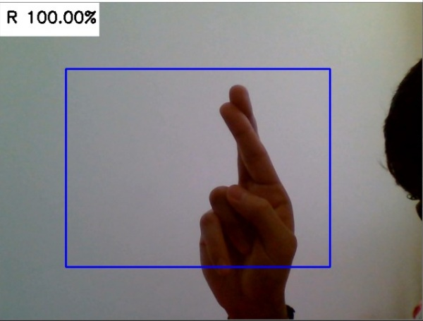
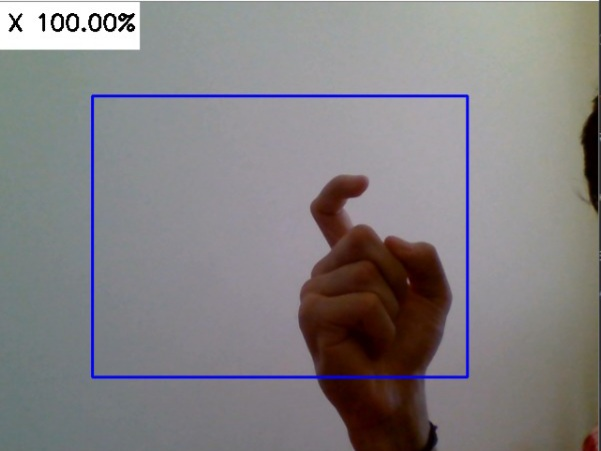
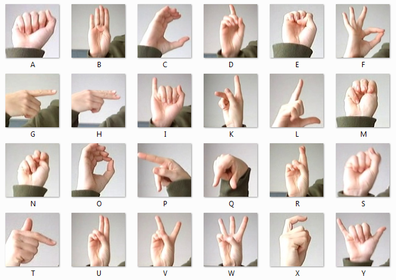
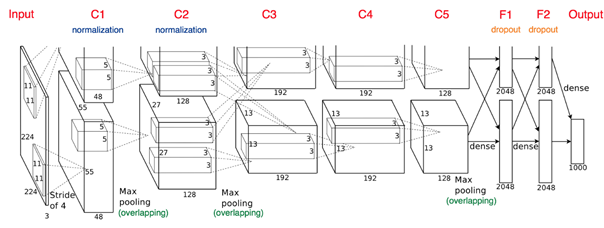

# SignLanguageRecognition
## An overview of the model


## Setting up
Run ```calibration.py``` to calibrate your hand gestures for every alphabet. This will aid in improving the accuracies while predicting from the trained model.


It will save a numpy array where each element specifies whether the fingers are open/closed/half open-closed.

## Detecting from web cam:
    
    
    
    
    

## Reference:
 

### This project uses a CNN model that follows AlexNet architecture.

Image credits to Krizhevsky et al., the original authors of the AlexNet paper.

## Notes
Please note that ```detector_mediapipe.py``` gives more accurate results than ```detect_webcam.py```.

The `requirements.txt` file contains all the dependencies needed for the project.
```
pip install -r requirements.txt
```
[Mediapipe docs](https://google.github.io/mediapipe/solutions/hands.html)
[Trained models (Google Drive link)](https://drive.google.com/drive/folders/1LCBmiV4bkNyKg8ix4MCEMQQ2SJOmPh8X?usp=sharing)